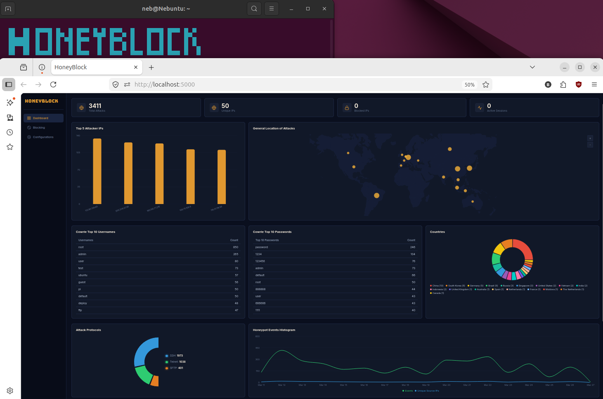

# HoneyBlock v2.0.1

A honeypot monitoring system that deploys a Cowrie SSH/Telnet honeypot, logs attacker activity to a SQLite database, and provides a real-time web dashboard with IP blocking via iptables.




## Features

- **Real-time Monitoring Dashboard** — Live feed of raw Cowrie logs, top attacker bar chart, and world map showing attack origins
- **IP Blocking** — One-click block/unblock attacker IPs using iptables firewall rules
- **3-Table Database** — Tracks attacker sessions, attacker profiles with geolocation, and block history
- **One-Command Installer** — Single `.run` file installs everything on a fresh Ubuntu machine
- **Desktop Shortcut** — Toggle HoneyBlock on/off from your Ubuntu desktop
- **Auto-Start** — Optional boot-on-startup for all services

## How It Works

```
Attacker tries SSH/Telnet (port 2222)
        |
        v
   [ Cowrie Honeypot ]  --logs-->  cowrie.json
                                       |
                                       v
                               [ Log Watcher ]  --parses-->  SQLite DB
                                                                |
                                                                v
                                                         [ Flask API ]
                                                                |
                                                                v
                                                       [ Web Dashboard ]
                                                       (localhost:5000)
```

## Quick Start

One command to download and install:

```bash
curl -fsSL https://github.com/nebwahaha/Honey/releases/download/Production/honeyblock-installer.run -o honeyblock-installer.run && chmod +x honeyblock-installer.run && sudo ./honeyblock-installer.run
```

Dashboard: `http://localhost:5000`

## Start / Stop

```bash
sudo /opt/honeyblock/honeyblock-ctl.sh
```

Or individually:

```bash
sudo systemctl start cowrie honeyblock honeyblock-watcher
sudo systemctl stop cowrie honeyblock honeyblock-watcher
```

## Test the Honeypot

SSH into the fake server:

```bash
ssh root@localhost -p 2222
```

If you get a `REMOTE HOST IDENTIFICATION HAS CHANGED` error (happens after reinstalls):

```bash
ssh-keygen -f "$HOME/.ssh/known_hosts" -R '[localhost]:2222'
ssh root@localhost -p 2222
```

Accept the fingerprint, type any password (it accepts everything). You're now in a fake shell. Type some commands, then `exit`. Check the dashboard — your session should appear.

## Penetration Testing

From another machine on the network, target the honeypot:

```bash
# Brute-force the honeypot with Hydra
hydra -l root -P /usr/share/wordlists/rockyou.txt ssh://TARGET_IP:2222

# Manual SSH attempt
ssh root@TARGET_IP -p 2222

# Nmap scan to see what the honeypot exposes
nmap -sV -p 2222 TARGET_IP
```

All attempts get logged to the dashboard. Use the dashboard to block attacker IPs with one click.

## Tech Stack

| Layer | Technology |
|-------|-----------|
| Honeypot | [Cowrie](https://github.com/cowrie/cowrie) SSH/Telnet |
| Backend | Python, Flask, SQLite |
| Frontend | React, TypeScript, Vite, Recharts, React Simple Maps |
| Firewall | iptables |
| Installer | Makeself self-extracting archive |

## Useful Commands

```bash
# Check service status
sudo systemctl status cowrie honeyblock honeyblock-watcher

# Live logs
sudo journalctl -u cowrie -f
sudo journalctl -u honeyblock -f
sudo tail -f /opt/honeyblock/logs/watcher.log

# Query the database directly
sqlite3 /opt/honeyblock/honeyblock.db "SELECT * FROM attacker_session ORDER BY timestamp DESC LIMIT 10;"
```

## Uninstall

Removes everything the installer created:

```bash
sudo systemctl stop honeyblock-watcher honeyblock cowrie 2>/dev/null; \
sudo systemctl disable honeyblock-watcher honeyblock cowrie 2>/dev/null; \
sudo rm -f /etc/systemd/system/cowrie.service \
           /etc/systemd/system/honeyblock.service \
           /etc/systemd/system/honeyblock-watcher.service \
           /etc/systemd/system/multi-user.target.wants/cowrie.service \
           /etc/systemd/system/multi-user.target.wants/honeyblock.service \
           /etc/systemd/system/multi-user.target.wants/honeyblock-watcher.service; \
sudo systemctl daemon-reload; \
sudo rm -rf /opt/honeyblock; \
sudo rm -rf /home/cowrie; \
sudo deluser --remove-home cowrie 2>/dev/null; sudo groupdel cowrie 2>/dev/null; \
sudo rm -f /usr/share/polkit-1/actions/com.honeyblock.ctl.policy; \
rm -f ~/Desktop/HoneyBlock.desktop; \
sudo iptables -S INPUT 2>/dev/null | grep -- '-j DROP' | while read -r rule; do
  sudo iptables $(echo "$rule" | sed 's/^-A/-D/')
done; \
sudo rm -rf /tmp/honeyblock-dist; \
ssh-keygen -f "$HOME/.ssh/known_hosts" -R '[localhost]:2222' 2>/dev/null
```

> APT packages (`python3`, `git`, `iptables`, etc.) are left in place. To also remove extras: `sudo apt-get remove --purge -y authbind libssl-dev libffi-dev && sudo apt-get autoremove -y`
